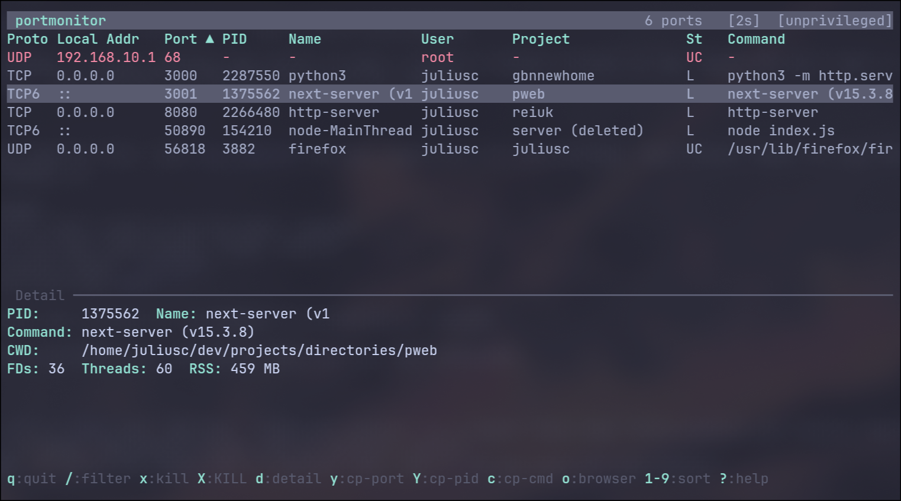

# portmonitor

TUI + CLI port monitor for Linux. See what's listening, which project owns it, and take action.



## Install

```sh
cargo install portmonitor
```

Or grab a binary from [releases](https://github.com/JNC4/portmonitor/releases).

### Arch Linux (AUR)

```sh
yay -S portmonitor
```

## Usage

Run with no arguments for interactive TUI:

```sh
portmonitor
```

### CLI commands

```sh
portmonitor list              # tabular port list
portmonitor list --json       # JSON output for scripting
portmonitor kill 3000         # SIGTERM process on port 3000
portmonitor kill 3000 --force # SIGKILL
portmonitor info 8080         # detailed process info
portmonitor watch 3000        # print bind/unbind events
```

### TUI keybindings

| Key | Action |
|-----|--------|
| `j`/`k`, `↑`/`↓` | Navigate |
| `g`/`G` | Top / bottom |
| `/` | Fuzzy filter across all columns |
| `d` | Toggle detail pane |
| `x` | Kill (SIGTERM) |
| `X` | Force kill (SIGKILL) |
| `y` | Copy port |
| `Y` | Copy PID |
| `c` | Copy command |
| `o` | Open in browser |
| `1`-`9` | Sort by column (press again to reverse) |
| `r` | Refresh |
| `?` | Help |
| `q` | Quit |

## Features

- **Fuzzy filter** — `/` to search across all columns (protocol, address, port, process, user, project, state, command)
- **Project detection** — shows which project directory each process runs from
- **Detail pane** — CWD, open FDs, threads, RSS, child processes, container ID
- **Kill** — SIGTERM/SIGKILL with confirmation
- **Clipboard** — copy port, PID, or full command
- **Container detection** — identifies Docker/Podman containers via cgroup
- **Color coding** — red for root, yellow for well-known ports, cyan for containers

## Requirements

Linux only. Reads `/proc` directly via the `procfs` crate — no shelling out to `ss` or `lsof`.

Works unprivileged (shows what your user can see). Run as root for full visibility.

## License

MIT
